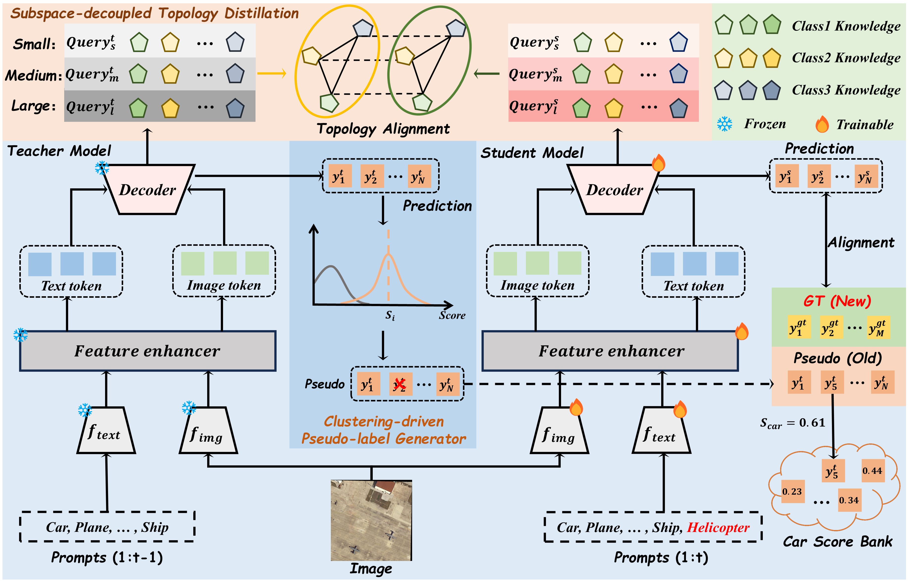

# RS-IOD：Scale-decoupled Topology Alignment with Pseudo-label Refinement for Remote Sensing Incremental Object Detection


*Figure 1: Overview of the proposed STAR-IOD. STAR-IOD preserves historical knowledge by aligning the decoder outputs of the student and teacher models via Subspace-decoupled Topology Distillation. In parallel, it incorporates a {Clustering-driven Pseudo-label Generator} to adaptively generate pseudo-labels for previously learned classes, thereby providing consistent and reliable supervision throughout the incremental learning process.*
[](https://opensource.org/licenses/MIT)

This repository contains the official implementation of the paper:


## Abstract
Remote sensing imagery typically arrives in the form of continuous data streams. Traditional detectors often forget previously learned categories when learning new ones; therefore, research on Remote Sensing Incremental Object Detection (RS-IOD) is of great significance. However, existing methods largely overlook the intra-class scale variations prevalent in remote sensing scenes, which undermines the effectiveness of knowledge transfer and old knowledge preservation. Moreover, RS-IOD also suffers from annotations missing, which cause the model to misclassify old-class instances as background. To address these challenges, we propose a novel framework, STAR-IOD. First, we introduce a Subspace-decoupled Topology Distillation (STD) module to transfer structural knowledge, explicitly aligning inter-class topological relationships and mitigating intra-class representation discrepancies induced by scale shifts. Furthermore, we introduce the Clustering-driven Pseudo-label Generator (CPG), a plug-and-play module that leverages K-Means clustering to dynamically identify class-specific thresholds, thereby guaranteeing an accurate distinction between true positive targets and background noise and alleviating the issue of missing annotations for old classes. We also constructed two Remote Sensing Incremental Object Detection datasets, DIOR-IOD and DOTA-IOD  to facilitate research on RS-IOD. Extensive experiments demonstrate that our method outperforms state-of-the-art approaches by 1.7% and 2.1% mAP on DIOR-IOD and DOTA-IOD, respectively, effectively alleviating catastrophic forgetting while preserving strong detection performance on both base and novel classes. 

## 🔨 Installation

### Requirements
* conda create -n STAR python=3.8 -y
* source activate STAR
* pip install torch==1.11.0+cu113 torchvision==0.12.0+cu113 torchaudio==0.11.0 --extra-index-url https://download.pytorch.org/whl/cu113
* pip install -U openmim
* mim install mmengine==0.8.5
* mim install mmcv==2.0.0
* cd our project
* pip install -v -e .

   
## 🚀 Training
1. **Download Dataset**: 
   Please download the DOTA-IOD and DIOR-IOD dataset from the following link:
   - **DOTA-IOD Link**: [Baidu Netdisk](https://pan.baidu.com/s/1MyQVHgKVMPb7zBR1ImKF-Q?pwd=y3bu) (Password: `y3bu`)
   - **DIOR-IOD Link**: [[Baidu Netdisk](https://pan.baidu.com/s/1ux_L-Kt3Pw0UJWUZAt0x1w?pwd=atgs) (Password: `atgs`)
### Data Preparation
```text
data/
├── DOTA/
│   ├── train/
│   ├── val/
│   └── annotations/
├── DIOR/
│   ├── train/
│   ├── val/
│   └── annotations/
```
### GPU Training
```text
# Phase 1 训练
CUDA_VISIBLE_DEVICES=0,1,2,3 bash ./tools/dist_train.sh ./configs/gdino_inc/dior/dior_phase1.py 4

# Phase 2 训练 (开启混合精度训练 --amp)
CUDA_VISIBLE_DEVICES=0,1,2,3 bash ./tools/dist_train.sh ./configs/gdino_inc/dior/dior_phase2.py 4 --amp
```

## ⚡ Inference / Testing
```text
CUDA_VISIBLE_DEVICES=0,1,2,3 bash ./tools/dist_test.sh ./configs/gdino_inc/dior/dior_phase1.py ./work_dirs/dior_phase1/epoch_12.pth 4 --cfg-options test_evaluator.classwise=True
```
## Acknowledgement
Our code is based on the project MMDetection. Thanks to the work [GCD](https://github.com/Never-wx/GCD).

## 🖊️ Citation
If you find this project useful in your research, please consider citing our paper:


Acknowledgement
This project is based on MMDetection and GCD. Thanks for their excellent work.
